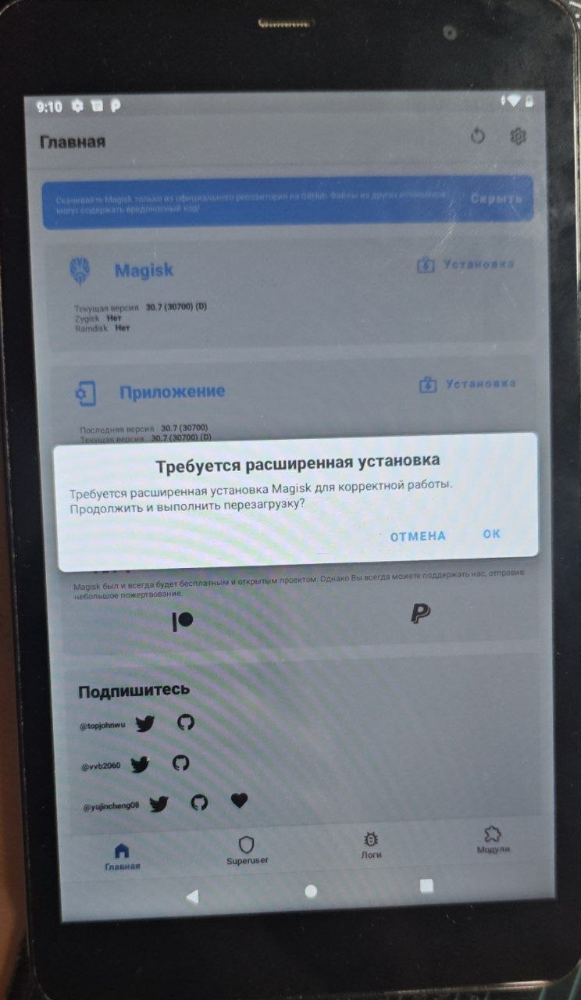
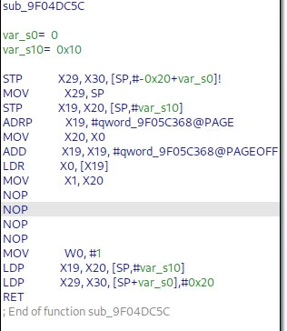

# как я пытался(от слова пытка) рутировать планшет DEXP URSUS R180



Сразу по информации открытой:
android 9, процессор sc9863a

основные проблемы, которые видны сразу
1. темы на 4pda или других форумах, кроме платного gsm НЕТУ. нету даже официальной прошивки
2. стандартный скрипт для разблокировки unisoc не работал
3. если он зависает в brom(при ошибки подписи), его невозможно перезагрузить. только отпаивать аккумулятор
4. brom не может дампить прошивку без FDL файлов, а это ЧАСТЬ ПРОШИВКИ КОТОРОЙ У МЕНЯ НЕТ

решение: скрипт на разблокировку переделал костылями и запустил
FDL взял от другого планшета(dexp ursus k51) и он работает, смог сдампить boot. Но решил все таки для надёжности купить оригинальную прошивку на GSMFORUM, в итоге разницы нету.

но появилась другая проблема - заблокирована загрузка(fastboot flash), даже если загрузчик типо "разблокирован"

стал копать в сторону BROM, т.к на fastboot пустышку больше не было надежд. Но он тоже не позволял записывать

нашел эксплоит для BROM. но там нету поддержки этого кирпича. 
https://github.com/TomKing062/CVE-2022-38694_unlock_bootloader

есть автоматический скрипт для патча FDL1(я проверил и действительно проверка подписи удалилась!), но FDL2 пришлось патчить вручную

успешно запатчил(через ida pro пару nop) и прошил

```
FDL2 >w vbmeta vbmeta-test.img
file size : 0x100000
[========================================] 100.0% Speed:  7.04Mb/s
Write Part Done: vbmeta, target: 0x100000, written: 0x100000
```
_патченные fdl файлы залил_

Но словил bootloop, видимо не проходит проверка подписи vbmeta. Я уж молчу, что если прошить бут, без флагов vbmeta будет бутлуп

И тут придумываю решение: Есть слитые ключи подписи rsa4096_vbmeta.pem!! И вот ими я подписал boot.img. 
```
avbtool erase_footer --image image.img
avbtool add_hash_footer \
                    --image image.img \
                    --partition_size 36700160 \
                    --partition_name boot \
                    --key rsa4096_vbmeta.pem \
                    --algorithm SHA256_RSA4096
```


И теперь бутлуп другой, система как-будто прошла проверки подписи, но все равно упала из-за кривого патча магиском

в итоге я запатчил рекавери в магиске(патч recovery вместо boot), но зашил этот образ не в рекавери, а в бут, предварительно подписав!! _образ залил в репозиторий_
